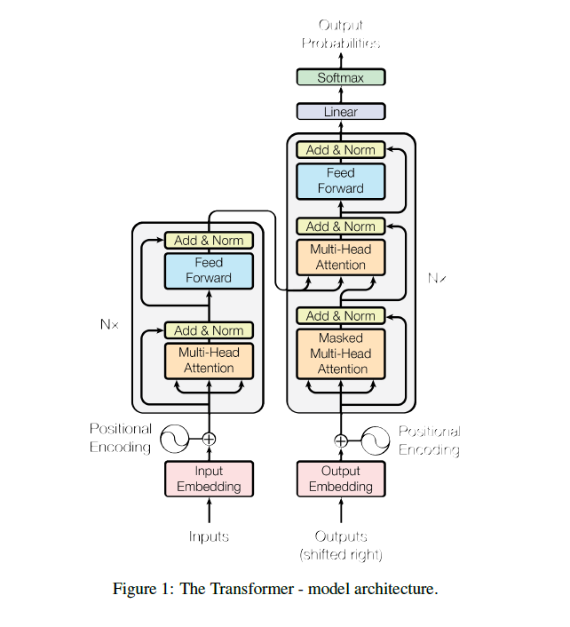

# TransformerArchitecture

This repository contains the **complete architecture of a Transformer built from scratch in PyTorch**, strictly following the original paper:  
**"Attention Is All You Need" (Vaswani et al., 2017).**

The model has been implemented without relying on high-level libraries (like Hugging Face’s prebuilt Transformers), ensuring you understand the core mechanism of attention, positional encoding, encoder-decoder stacks, and training workflow.
/////
---

## 📌 Technical Details

- **Architecture**: Encoder-Decoder Transformer (Multi-Head Attention, Positional Encoding, Layer Normalization, Residual Connections, Feed-Forward Networks).  
- **Paper Reference**: [Attention Is All You Need](https://arxiv.org/abs/1706.03762)  
- **Framework**: PyTorch  
- **Tokenizer**: [Helsinki-NLP/opus-mt-en-fr](https://huggingface.co/Helsinki-NLP/opus-mt-en-fr)  
- **Dataset Used**: [Opus Books English → French](http://opus.nlpl.eu/Books.php)  
- **Training Hardware**: TPU v8 (Google Colab)  
- **Implementation**: From scratch (no external high-level Transformer libraries).  

---

## 🧠 Transformer Architecture (Original)

The Transformer relies entirely on **self-attention** and **feed-forward layers**, removing recurrence and convolutions.

<p align="center">
 
</p>

---

## 📊 Training Details

- **Epochs Trained**: **07**

| Epoch | Training Loss | Validation Loss |
|-------|---------------|-----------------|
| 1     | 2.49          | 2.66            |
| 7     | 0.68          | 0.78            |

---

## 🏆 Benchmarks

- **BLEU Score**: `0.4455`  
- **ROUGE Scores**:  
  - ROUGE-1 (F1): `0.3945`  
  - ROUGE-2 (F1): `0.1416`  
  - ROUGE-L (F1): `0.3494`  

These results demonstrate that the model successfully learned meaningful English → French translation mappings within limited epochs and Colab free-tier constraints.

---

## 📖 Key Features of This Implementation

- Implemented **Scaled Dot-Product Attention** from scratch  
- Implemented **Multi-Head Attention** (parallel self-attention layers)  
- **Positional Encoding** using sinusoidal functions  
- **Residual Connections** and **Layer Normalization**  
- **Encoder-Decoder stacking** with modular class structure  
- **Teacher Forcing** applied during training  
- Metrics calculated: **BLEU, ROUGE-1/2/L**  

---

## 🚀 Usage

1. Clone this repository:
   ```bash
   git clone https://github.com/your-username/TransformerArchitecture.git
   cd TransformerArchitecture
